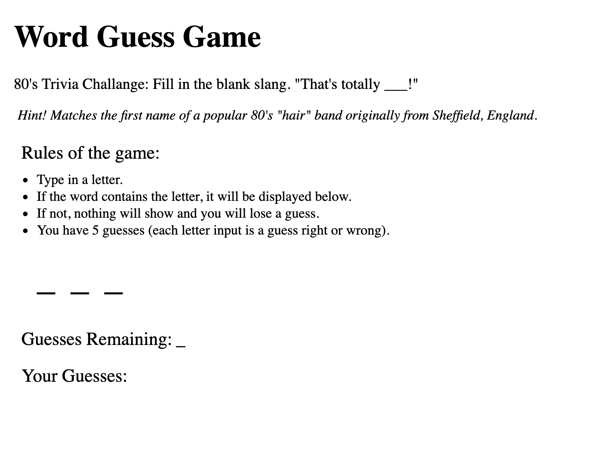

# Word-Guess-Game

## Page preview: 

## About the project:
This is the more challegning of the 2 assignment options we had to pick 1 from. I did the easier one first just to get the homework done. I had extra time so I attempted to build this game. I don't have all the features yet and I basically ran out of time (one more day would have gotten it built). I'm pushing what I have now. I will finish this on my own however because I liked it. Below are the specs from class.

* Choose a theme for your game! In the demo, we picked an 80s theme: 80s questions, 80s sound and an 80s aesthetic. You can choose any subject for your theme, though, so be creative!
* Use key events to listen for the letters that your players will type.
* Display the following on the page:
* Press any key to get started!
* Wins: (# of times user guessed the word correctly).
* If the word is madonna, display it like this when the game starts: _ _ _ _ _ _ _.
* As the user guesses the correct letters, reveal them: m a d o _ _ a.
* NMumber of Guesses Remaining: (# of guesses remaining for the user).
* Letters Already Guessed: (Letters the user has guessed, displayed like L Z Y H).
* After the user wins/loses the game should automatically choose another word and make the user play it.

## Techologies used to build:
  * HTML
  * CSS
  * Javascript

## Methodology:
Started on this last night. I used the js methods learned from this week to try and build out according to the specs. Ran into various issues with the count features (my code was double copunting guesses remaining). Sorry my comments in the js file are sparse. Definitly will finish this. Added this (and the other option for the assignment) to my Basic Portfolio (New), Bootstrap and Responsive sites (but need to go back and fix the stlying....)

